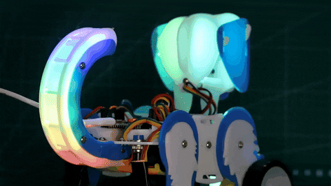
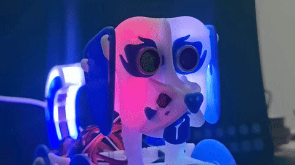
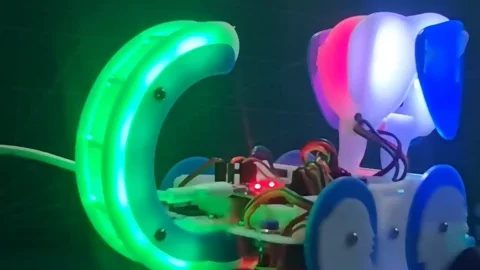

# ii_LedArray Library

## Overview
The `ii_LedArray` library is a versatile and user-friendly tool designed for controlling LED arrays with ease and efficiency. Ideal for projects involving LED displays, light animations, and interactive art installations.



*GIF: examples/ledarray_07_MoveRainbow*

## Features
- **Ease of Use**: Simplify the process of controlling complex LED arrays.
- **Custom Animations**: Support for creating custom light patterns and animations.
- **Highly Configurable**: Adjustable settings to suit various LED array configurations.






*GIF: examples/ledarray_11_MultiFunctions*


## Installation
1. Download the `ii_LedArray` library.
2. Extract the downloaded file.
3. Place the `ii_LedArray` folder in your Arduino 'libraries' directory.
4. Restart the Arduino IDE.

## Usage
To use the `ii_LedArray` library in your Arduino sketches, include it at the top of your code:
```cpp
#include <ii_LedArray.h>
```

## Examples

### Basic LED Control


This sketch illustrates the use of ii_LedArray library functions to alternate colors on an LED array. It showcases initializing the LED array, setting individual LED colors, and updating the display in a simple and efficient manner. Functions demonstrated include begin() for initialization, setColor() for color assignment, and update() to apply changes to the LED array.

```cpp
#include <ii_LedArray.h>

ii_LedArray ledarray = ii_LedArray(4, 6);  // Initialize the LED array on pin 6 with 4 LEDs

void setup() {
  ledarray.begin();      // Initialize the LED strip
}

void loop() {
    ledarray.setColor(0, 255, 0, 0);  // Set color of LED at index 0 to red
    ledarray.setColor(1, 0, 0, 255);  // Set color of LED at index 1 to blue
    ledarray.update();                  // Update the strip to apply the color change
    delay(100); 

    ledarray.setColor(0, 0, 0, 255);  // Set color of LED at index 1 to blue
    ledarray.setColor(1, 255, 0, 0);  // Set color of LED at index 2 to red
    ledarray.update();                  // Update the strip to apply the color change
    delay(100); 
}
```

### LED Color Toggle : smooth transitions
 


LED Color Toggle: Demonstrates toggling all LEDs between red and blue every second, using ii_LedArray for smooth transitions and color updates.

```cpp
#include <ii_LedArray.h>  // Include the ii_LedArray library

// Initialize an LED array on pin 6 with 4 LEDs
ii_LedArray ledarray = ii_LedArray(4, 6);

long ltime;        // Variable to store the last time the LED colors were updated
bool colorselect;  // Boolean flag to toggle between red and blue colors

void setup() {
  ledarray.begin();            // Initialize the LED strip
}

void loop() {
  // Check if 1000 milliseconds (1 second) have passed since the last update
  if (millis() - ltime > 1000) {
    ltime = millis();  // Update the last time variable to the current time

    // Toggle the entire LED array between red and blue every second
    if (colorselect) {
        ledarray.setColorTrans(255, 0, 0, millis(), 1000); // Set all LEDs to red
    } else {
        ledarray.setColorTrans(0, 0, 255, millis(), 1000); // Set all LEDs to blue
    }

    colorselect = !colorselect;  // Toggle the colorselect flag
  }

  ledarray.update();  // Update the LED array with the new color data
}
```


### LED Ripple Effect : smooth transitions 


Create a ripple effect across LEDs, sequentially shifting colors with time delays, showcasing dynamic and visually appealing patterns.

```cpp
#include <ii_LedArray.h>  // Include the ii_LedArray library

// Initialize an LED array on pin 6 with 4 LEDs
ii_LedArray ledarray = ii_LedArray(4, 6);

long ltime;        // Variable to store the last time the LED color was updated
bool colorselect;  // Boolean flag to toggle between colors

void setup() {
  ledarray.begin();            // Initialize the LED strip
}

void loop() {
  // Check if 1000 milliseconds (1 second) have passed since the last update
  if (millis() - ltime > 1000) {
    ltime = millis();  // Update the last time variable to the current time

    // Toggle between red and blue colors every second for each LED in a sequence
    if (colorselect) {
      // Sequentially set each LED to red (RGB: 255, 0, 0) with staggered timing
      for(int n = 0; n < 4; n++){
        ledarray.setColorTrans(n, 255, 0, 0, millis() + (n * 100), 400);
      }
    } else {
      // Sequentially set each LED to blue (RGB: 0, 0, 255) with staggered timing
      for(int n = 0; n < 4; n++){
        ledarray.setColorTrans(n, 0, 0, 255, millis() + (n * 100), 400);
      }
    }

    colorselect = !colorselect;  // Toggle the colorselect flag
  }

  ledarray.update();  // Update the LED array with the new color data
}
```


### [More Examples as needed]

## Practical Usage
- **Decorative Lighting**: Create dynamic lighting displays for home or commercial spaces.
- **Interactive Art**: Develop interactive LED installations for art projects.
- **Educational Projects**: Teach students about electronics and programming through engaging LED projects.

## Images and GIFs
- The images and GIFs in this README illustrate the potential applications and effects achievable with the `ii_LedArray` library. Actual implementation might vary based on your specific hardware and software setup.

## Contributing
We welcome contributions to enhance the `ii_LedArray` library. Feel free to fork the repository, make your changes, and submit a pull request.

## License
This project is licensed under the GNU Lesser General Public License v3.0 (LGPL-3.0) - see the [LICENSE](LICENSE) file for details. The LGPL-3.0 is a popular open-source license that allows for both private and commercial use while ensuring that improvements to the library itself remain open-source. This license permits linking the `ii_Timer` library with other software that might not be under the LGPL, providing flexibility for a wide range of applications.
