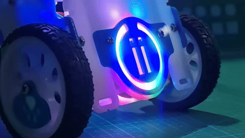

# ii_LedArray Library

## Overview
The `ii_LedArray` library is a versatile and user-friendly tool designed for controlling LED arrays with ease and efficiency. Ideal for projects involving LED displays, light animations, and interactive art installations.


*GIF: examples/ledarray_07_MoveRainbow*

## Features
- **Ease of Use**: Simplify the process of controlling complex LED arrays.
- **Custom Animations**: Support for creating custom light patterns and animations.
- **Highly Configurable**: Adjustable settings to suit various LED array configurations.





*GIF: examples/ledarray_11_MultiFunctions*


## Installation
1. Download the `ii_LedArray` library.
2. Extract the downloaded file.
3. Place the `ii_LedArray` folder in your Arduino 'libraries' directory.
4. Restart the Arduino IDE.

## Usage
To use the `ii_LedArray` library in your Arduino sketches, include it at the top of your code:
```cpp
#include <ii_LedArray.h>
```

## Examples

### Basic LED Control
This example demonstrates how to control a basic LED array.

```cpp
#include <ii_LedArray.h>

// Code to initialize and control the LED array

// Placeholder for image: "Basic_LED_Control_Example.jpg"
```

*Image: Basic LED Control Example*

### Advanced LED Animation
Showcase advanced features with a custom LED animation.

```cpp
#include <ii_LedArray.h>

// Code for creating a custom LED animation

// Placeholder for GIF: "Advanced_LED_Animation.gif"
```

*GIF: Advanced LED Animation*

### [More Examples as needed]

## Practical Usage
- **Decorative Lighting**: Create dynamic lighting displays for home or commercial spaces.
- **Interactive Art**: Develop interactive LED installations for art projects.
- **Educational Projects**: Teach students about electronics and programming through engaging LED projects.

## Images and GIFs
- The images and GIFs in this README illustrate the potential applications and effects achievable with the `ii_LedArray` library. Actual implementation might vary based on your specific hardware and software setup.

## Contributing
We welcome contributions to enhance the `ii_LedArray` library. Feel free to fork the repository, make your changes, and submit a pull request.

## License
This project is licensed under the GNU Lesser General Public License v3.0 (LGPL-3.0) - see the [LICENSE](LICENSE) file for details. The LGPL-3.0 is a popular open-source license that allows for both private and commercial use while ensuring that improvements to the library itself remain open-source. This license permits linking the `ii_Timer` library with other software that might not be under the LGPL, providing flexibility for a wide range of applications.
